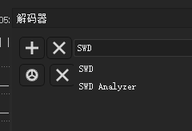

# DSView swd analysis decoder

This decoder is used to help you decode and analyze SWD communication data more conveniently.

## who to install it

1. download and install [DSView](https://dreamsourcelab.cn/download/)
2. run `install.py`
3. select `SWD Analyzer` decoder

](./doc/assets/DSView_select_swd_analysis_decoder.png)

## Reference

- <https://sigrok.org/wiki/Protocol_decoder_API>
- <https://sigrok.org/wiki/Protocol_decoder_HOWTO>

